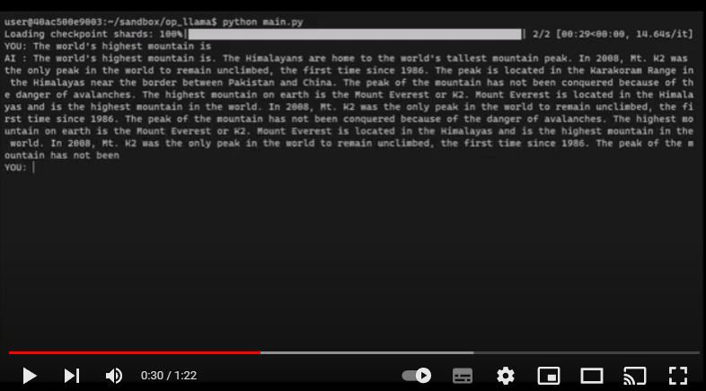

# "open-llama" hands-on

I have tried open-llama.
I don't fully understand it yet, but I can confirm that it works as a first look.

## Download models

I will use the model as a hugging face model.
To do this, I first need to download the complete set of models.
This is because the repository also contains other models,
and the model for huggingface is one level down in the directory.

```
git clone https://huggingface.co/openlm-research/open_llama_7b_preview_300bt
```

## Use models as hugging face models

It appears that one level down is the huggingface model as follows

```
model_path ="/home/user/sandbox/open_llama_7b_preview_300bt/open_llama_7b_preview_300bt_transformers_weights"
```

## Setup environment

```
conda update -n base -c defaults conda --yes
conda create --yes -n env-op-llama
conda activate env-op-llama
conda install python=3.10.10 --yes
python -m pip install --upgrade pip
```

## Install packages

```
pip install torch torchvision torchaudio --index-url https://download.pytorch.org/whl/cu117
pip install accelerate transformers
pip install SentencePiece
```

## Run

```
python main.py
```

### Play on Youtube

[](https://youtu.be/R5dlEuG7FDc)


## Tuning

```
params = {
        "prompt": prompt,.
        "temperature": 0.5, # The closer to 0, the sharper the probability distribution and the less variation
        "max_new_tokens": 256, # Number of tokens to generate in one turn.
        "context_len": 1024, # Length of the context (conversation continuity) when in chat mode.
        "use_top_k_sampling": True, # True: use TopK sampling. This reduces repetition of sentences.
        "use_bos_for_input": True, # Add BOS to input token prefix; recommended by open_llama.
        "force_set_bos_token_id": 1, # As of 4/5/2023, open_llama's tokeniser config is not set, so set manually
        "force_set_eos_token_id": 2, # As of 5/4/2023, open_llama's tokeniser config is not set, so set manually.
        "stop_strs": stop_str, # Stop string for hanging up sentences when in chat mode.
    }
```

## Next to do

What I want to do next.
We are exploring stable prompts for chatting with two people, the USER and the ASSISTANT.

## References

- https://github.com/openlm-research/open_llama : Great initiative
- https://github.com/lm-sys/FastChat : Some of my code is based on FastChat
- https://github.com/huggingface/transformers : Some of my code is based on Transformers
